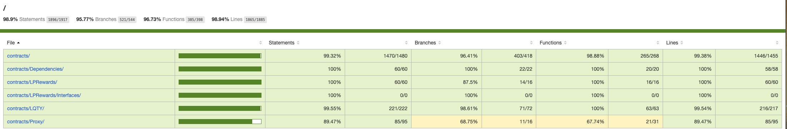
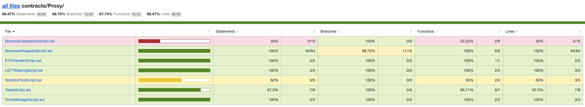
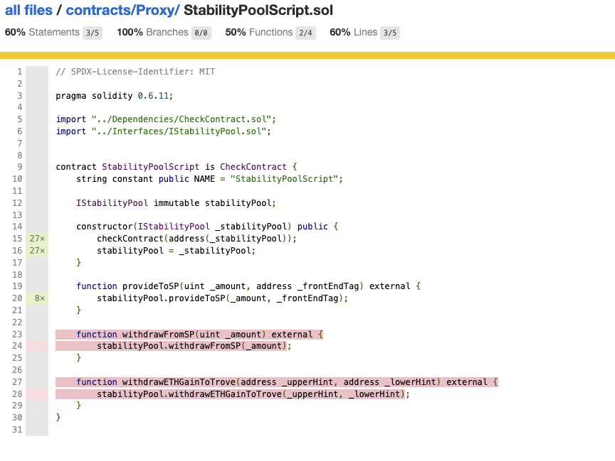
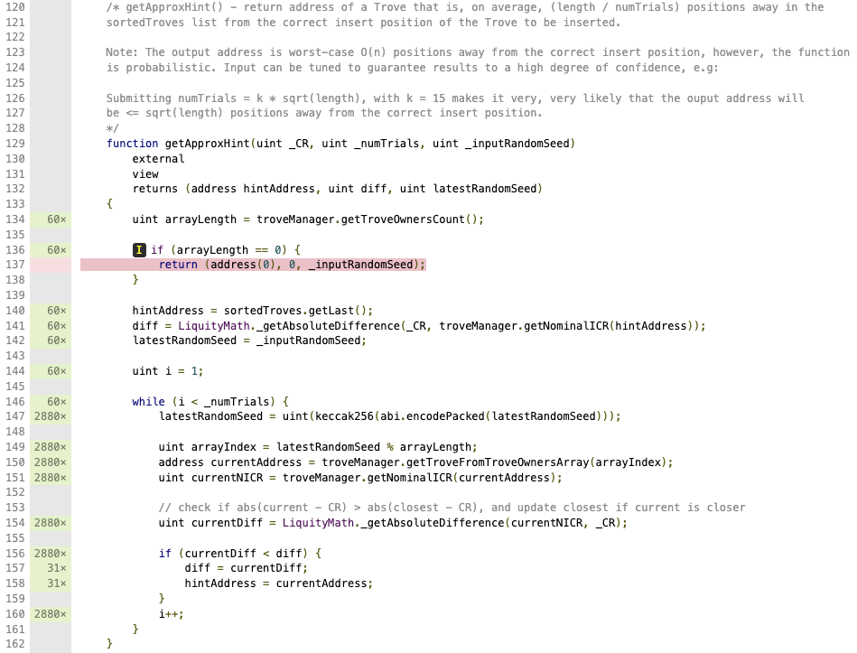
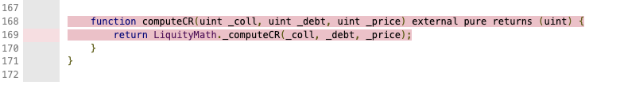
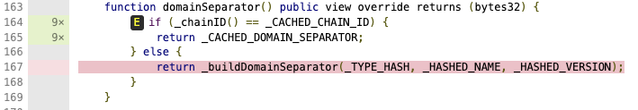
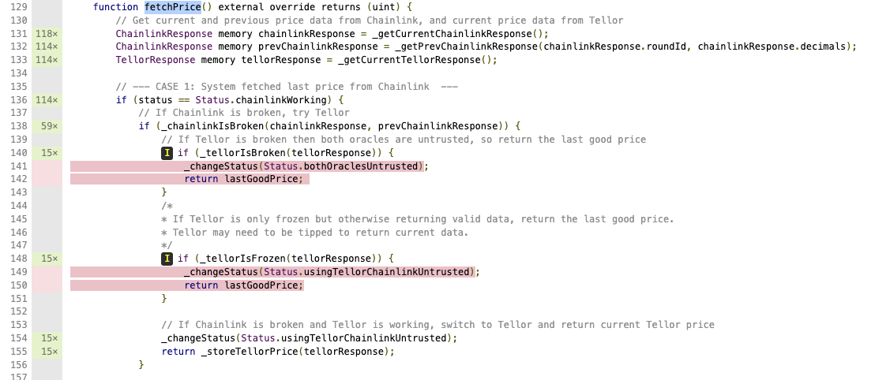

## Liquity Protocol Coverage Findings

To run tests with coverage:
- Clone https://github.com/liquity/dev
- `cd dev/packages/contracts/`
- `yarn`
- `yarn coverage`

When coverage is done, one can find istanbul generated HTML pages under `dev/packages/contracts/coverage/index.hmtl

---

# Coverage stats

## Overall coverage

Overall coverage looks good for Liquity Protocol, resulting in > 98% coverage of all contracts

## Missing coverage
Let's stop on this and look closer on what is not covered.

### Missing coverage on `BorrowerOperationsScript.sol`
Most of uncovered percents coming from **failing tests** for `BorrowerOperationsScript.sol`:

---

### Missing coverage on `StabilityPoolScript.sol`
40% of StabilityPoolScript.sol is not covered with tests:

---

Uncovered functions are:
- `withdrawFromSP`
- `withdrawETHGainToTrove`

But they are covered in other tests a lot of times, so all good here

--- 
### Missing coverage on `HintHelpers.sol`
- There is one statement missing coverage in `HintHelpers.sol` in function `getApproxHint`:

- One more function that is not covered is `computeCR`:

---

### Missing coverage on `LUSDToken.sol`
`domainSeparator` uncached statement is not covered, can be a subject to investigate:

---

### Missing coverage on `PriceFeed.sol`:
In function `fetchPrice` untrusted-oracle-branch is not covered. Potential issue:
